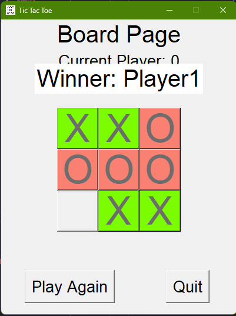

[](https://github.com/LeninKhangjrakpam/Tic-Tac-Toe/actions/workflows/python-app-build-release.yml)
[](https://github.com/LeninKhangjrakpam/Tic-Tac-Toe/actions/workflows/python-app-run-test.yml)

# Alpha-Beta Tic-Tac-Toe

Final Project done as part of CIP   

Alpha-Beta Tic-Tac-Toe is a classic Tic-Tac-Toe game implemented with a graphical user interface using Python's Tkinter library. The project features an AI opponent that uses the Alpha-Beta Pruning algorithm to make optimal moves, providing a challenging experience for players.

## Features
- **Graphical User Interface**: A user-friendly interface created with Tkinter for easy interaction.
- **AI Opponent**: An intelligent AI powered by the Alpha-Beta Pruning algorithm, capable of making strategic moves.
- **Game Flow**: Alternates between human and AI turns, detects game outcomes (win, loss, or draw), and provides options to restart the game.
- TODO

## Usage
### Download Relase
- To get the latest release:  [Release](https://github.com/LeninKhangjrakpam/Tic-Tac-Toe/releases)  
- After downloading the executables, double click on it to start the app

### Build from Source
- To build from source, download the source code from [Release](https://github.com/LeninKhangjrakpam/Tic-Tac-Toe/releases)  
- Unzip the `.zip` file, then run the following command
```bash
cd tictactoe
```
- Create a virtual env with python version `>=3.9`
```bash 
python -m venv venv
source venv/Scripts/activate # Activate it
```
```bash
pip install -r requirements.txt     # download dependencies
pyinstaller main.schema             # build
```
- Now, you'll find your build in `dist/` folder as `main.exe`

## Game



## Development
- Git clone the repo
- Run `python main.py` to start the app
- For building binaries: `pyinstaller main.schema`
  

### Test Project
```bash
cd tictactoe
pytest
```
View test log - [test.log](https://github.com/LeninKhangjrakpam/Tic-Tac-Toe/blob/main/test/test.log)

### Benchmark
View Benchmark - [log.log](https://github.com/LeninKhangjrakpam/Tic-Tac-Toe/blob/main/test/log.log)
```bash
python test/benchmark.py
```